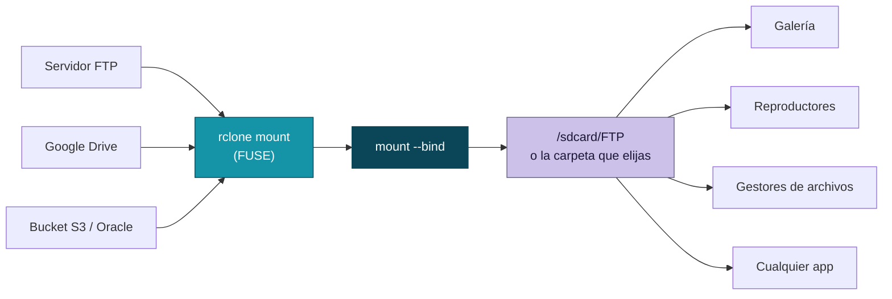
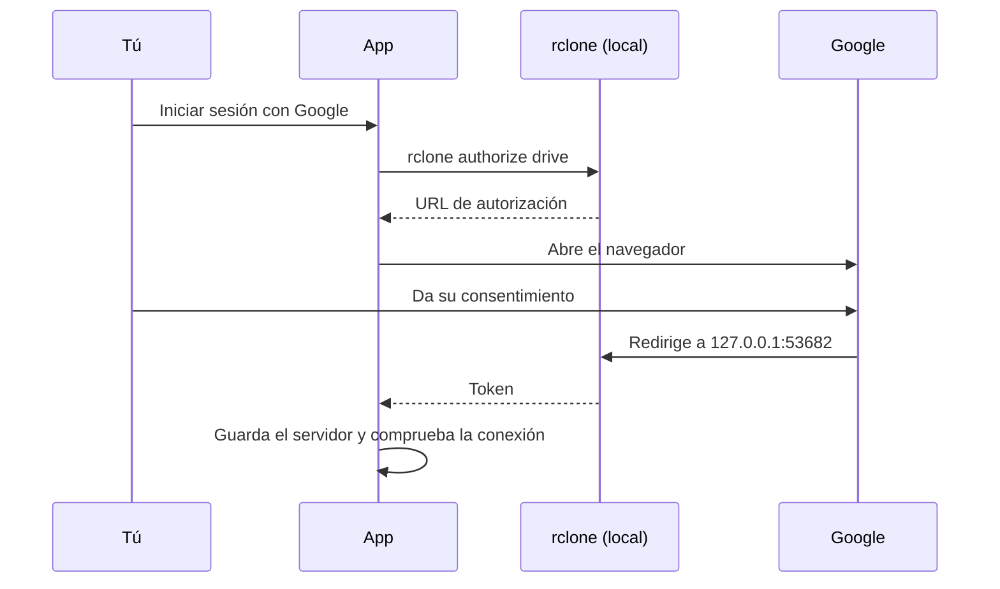

  

  
  
  
  

  
  
  
  
  
  
  

<h3 align="center">Monta servidores FTP, Google Drive y buckets S3 (Oracle Cloud y compatibles) como una carpeta más de tu almacenamiento interno. Cualquier app puede usarlos, sin configurar nada en cada una.</h3>

---

## Cómo funciona

Iniciar sesión con Google se hace en el propio teléfono, sin PC:

## Características

### Servidores en una pila de tarjetas

- Cada servidor es una tarjeta; la seleccionada se abre y las demás asoman su franja.
- Tocar una tarjeta elige cuál se monta. Agregar, editar y eliminar desde la misma pantalla.
- Compatible con **FTP**, **Google Drive** y **S3** (Oracle Cloud Object Storage y cualquier servicio compatible).
- En pantalla ancha (apaisado, tablets) se ven **dos paneles uno al lado del otro**, uno por tipo de remoto; en vertical siguen mezclados en una sola pila, como siempre.
- Las contraseñas se guardan ofuscadas con `rclone obscure`.
- Al editar, dejar la contraseña vacía conserva la anterior.

### Encuentra tu servidor FTP solo

- Botón **Buscar servidores FTP en mi red**: recorre la subred local y muestra los que responden.
- Sondea el puerto 21 y los que usan las apps de servidor FTP para Android y Termux (2121, 2221 y 2222).
- Usa la red Wi-Fi o Ethernet real aunque haya datos móviles o VPN activos.
- No necesita root: elegir uno rellena Host y Puerto.

### S3 y Oracle Cloud Object Storage

- En **Nuevo servidor > S3** eliges **Oracle Cloud** (namespace + región; el endpoint `https://<namespace>.compat.objectstorage.<región>.oraclecloud.com` se arma solo) u **Otro proveedor** (endpoint propio: MinIO, Wasabi, R2, B2...).
- Se inicia sesión con una clave de acceso: en Oracle, una **Customer Secret Key** (Perfil > Mi perfil > Claves secretas de cliente). La clave secreta solo existe en `rclone.conf` (chmod 600).
- **Bucket** opcional (`bucket` o `bucket/carpeta`): se monta solo ese. Vacío monta la lista de buckets, pero Oracle exige permisos de listado; si tu clave no los tiene, escribe el bucket.
- Al guardar, lista el bucket con la clave para confirmar endpoint, región, permisos y red, y traduce los errores típicos (`SignatureDoesNotMatch`, `AccessDenied`, `NoSuchBucket`...).
- **Icono por proveedor:** cada proveedor S3 tiene su propio icono (Oracle Cloud y Amazon S3 llevan su logo; los demás, una nube genérica). El proveedor se detecta por el dominio del endpoint (`S3Provider` en `Conf.kt`); para agregar uno nuevo basta una entrada del enum con los sufijos de su dominio y su icono en `serverIconFor` (`StyleKit.kt`).
- **Carpetas vacías:** se monta con `--s3-directory-markers` (rclone 1.64+): al crear una carpeta desde el explorador rclone sube un objeto vacío `carpeta/`, así se conserva aunque no tenga archivos y se puede montar vacía.
- **Rendimiento de S3 / Oracle:** al elegir un servidor S3, la tarjeta **Rendimiento** de Inicio suma sus propias opciones (`S3PerfSection`; se aplican al volver a montar; cada una puede quedar en automático):
  - **Menos peticiones** (automático: sí en Oracle, no en otros): `--use-server-modtime`, `--s3-no-head` y `--s3-no-head-object`. Evita un HEAD por archivo para leer su fecha (clave al listar o precargar miles de archivos) y las copias en el servidor que hacía rclone tras cada subida. Contrapartida: la fecha de modificación pasa a ser la de subida.
  - **Listados en caché** (5 min a 6 h; automático: 30 min en Oracle, 10 min en Máximo y 5 min en Equilibrado para los demás): S3 no avisa de cambios hechos fuera del montaje, así que es lo que tarda en verse un archivo subido por otra vía.
  - Solo en **Máximo**: **lectura paralela** (1 a 12 trozos del mismo archivo, `--vfs-read-chunk-streams`, 6 por defecto), **subida paralela** (1 a 16 partes, `--s3-upload-concurrency`, 6 por defecto) y **tamaño de parte** (8, 16, 32 o 64 MB, `--s3-chunk-size`, 16 por defecto). La RAM de subida en el peor caso es 4 transferencias × partes × tamaño; si pasa de 768 MB, el script baja las partes simultáneas y la tarjeta lo avisa. Con *menos peticiones* desactivado, los archivos de más de una parte se suben en paralelo (`--s3-upload-cutoff`); activado, suben de una vez hasta 200 MB.
  - Las opciones del backend se añaden solo si el binario de rclone las conoce (`rclone help flags`). Los ajustes viven en `config/s3_*` y el cálculo está en `scripts/perf_opts.sh` (`s3_mount_opts`), compartido con la prueba de rendimiento.
- El bucket se guarda en la clave propia `bind_path` de la sección; rclone la ignora y la leen `mount.sh` y `check_remote.sh`.

### Amazon S3

- En **Nuevo servidor > S3 > Proveedor** elige **Amazon S3** y escribe solo la **región del bucket** (por ejemplo `us-east-1`): el endpoint `https://s3.<región>.amazonaws.com` se arma solo (`.amazonaws.com.cn` en las regiones de China) y el remoto se guarda con `provider = AWS`.
- Se inicia sesión con una **clave de acceso de IAM** (Credenciales de seguridad > Crear clave de acceso) de un usuario con permisos sobre el bucket. Como en Oracle, se recomienda escribir el **bucket** (`bucket` o `bucket/carpeta`).
- Si la región no es la del bucket, al guardar la comprobación avisa «la región no es la del bucket».
- Mismas opciones de rendimiento que el resto de S3, pero por defecto **sin** recortar peticiones (Oracle sí): el listado se cachea 5 min en Equilibrado y 10 min en Máximo.
- Su tarjeta usa el naranja de AWS (seleccionada: fondo naranja con texto y logo en azul oscuro) y el logo cambia de variante según el fondo: letras azules sobre fondo claro y blancas sobre fondo oscuro.

### Google Drive sin PC

- Inicio de sesión desde el teléfono con el flujo de autorización de rclone.
- Modo **solo lectura**.
- Interruptor para **permitir archivos marcados como malware** (`acknowledge_abuse`), que Drive bloquea con el error 403 `cannotDownloadAbusiveFile`.
- Montar solo una **carpeta raíz** o una **unidad compartida**.
- **Client ID y Secret propios**, o pegar un token generado en otro equipo.
- Al guardar, comprueba la sesión, la red, el DNS y los certificados listando la raíz de Drive.

### Montaje que se mantiene

- Se monta con `rclone mount` y se expone con `mount --bind` en la **carpeta de destino que elijas** (por defecto `/sdcard/FTP`), con selector de carpetas integrado.
- **Montar al iniciar**: espera a que el almacenamiento esté desbloqueado y reintenta hasta que haya red.
- Un **vigilante** restaura el bind si Android o alguna app lo quita.
- Cambiar de servidor con uno ya montado se hace con un solo botón.
- Caché de disco acotada para Drive.
- **Rendimiento** Equilibrado o Máximo: el modo Máximo usa caché completa también en FTP, lectura anticipada, descargas en paralelo y listados cacheados más tiempo. Además: en Drive se leen varios trozos del mismo archivo en paralelo (`--vfs-read-chunk-streams`, rclone 1.67+; se omite solo si el binario es más viejo) y se sube el ritmo de llamadas a la API (`--drive-pacer-*`), el doble de transferencias/verificaciones a la vez, las escrituras seguidas a un mismo archivo se agrupan antes de subir (`--vfs-write-back 15s`) y los listados usan un fingerprint más barato (`--vfs-fast-fingerprint`). El **tamaño de caché** es configurable (1 a 100 GB) y se dejan 2 GB libres.
  Con **caché en RAM** (tmpfs, opcional, solo en Máximo) las lecturas y escrituras ya cacheadas van a velocidad de RAM en vez de disco. Se pide confirmación antes de activarla: ocupa esa RAM mientras esté montado y se pierde al desmontar o reiniciar. `mount.sh` comprueba la RAM libre antes de montar el tmpfs; si no alcanza, sigue en disco y lo deja en Logs.
  **Precarga automática** (`scripts/preload.sh`): tras montar, si el perfil activo cachea lecturas completas (Máximo, o Drive en cualquier perfil), baja en segundo plano los archivos del remoto a la caché, respetando el tamaño configurado (deja 512 MB de margen) y con topes de tiempo por seguridad; el tope de cantidad de archivos por corrida es configurable (`config/preload_max_files`, 20000 por defecto) para no truncar en silencio remotos con miles de archivos sueltos. Así una app que abra esos archivos los encuentra ya locales en vez de esperar la descarga en ese momento. Queda registrada en Logs, y su progreso en vivo (archivos y MB) se puede seguir desde la tarjeta **Precarga de archivos** en Inicio (perfil Máximo), que también permite relanzarla a mano tras agregar contenido nuevo al remoto. Si el remoto tiene más contenido que el que se quiere precargar, conviene usar la carpeta raíz del servidor Drive para acotarlo.
  El botón **Probar rendimiento** abre una hoja con la prueba (`scripts/perf_test.sh`, con root): comprueba
  que las opciones con las que corre rclone son las de la configuración actual (avisa si cambiaste el perfil o la
  caché sin volver a montar), que hay espacio para la caché, que el listado funciona, y mide escritura y lectura
  (un trozo al azar de un archivo grande, leído dos veces, viendo si la caché en disco crece). Escribe un archivo
  temporal de 32 MB en la carpeta montada y lo borra. Guarda la última velocidad por perfil y tipo de servidor:
  probando una vez en Equilibrado y otra en Máximo se pueden comparar.

### Instalación y actualizaciones sin fricción

- El zip del módulo **trae la app dentro**: se instala sola al flashear.
- Reflashear **actualiza la app sin perder tus datos**, y la configuración del módulo se conserva.
- Si la instalación silenciosa falla, se reintenta al reiniciar y, como último recurso, abre el instalador del sistema.
- El módulo se actualiza desde el Manager de KernelSU.

### Diseño

- Material 3 con **color dinámico** (Material You) en Android 12 o superior.
- Modo **claro y oscuro** según el sistema, a pantalla completa.
- Esquinas amplias, animaciones con resorte y efecto de desenfoque.
- Ancho del contenido adaptable: crece en pantallas anchas en vez de dejar franjas vacías a los costados.
- Inicio también arma **doble panel** en pantalla ancha: montaje (servidor, carpeta, botón) a la izquierda, ajustes (autostart y rendimiento) a la derecha.
- Icono adaptable con versión monocromática para el tema de íconos.
- Pantallas de **Inicio**, **Servidores**, **Logs** y **Acerca de**, con la versión de la app y de rclone.

### Publicación automática

- Cada compilación exitosa publica un release con el módulo y el APK.
- Los tags `v*` publican una versión con nombre.

## Compatibilidad

| | |
|---|---|
| Root | KernelSU |
| Android | 8.0 o superior |
| Arquitectura | arm64 |
| Remotos | FTP, Google Drive, S3 |
| Motor | [rclone](https://rclone.org) |

---

  Usa <a href="https://rclone.org">rclone</a> (MIT), <a href="https://github.com/topjohnwu/libsu">libsu</a> (Apache 2.0) y <a href="https://github.com/chrisbanes/haze">Haze</a> (Apache 2.0).

