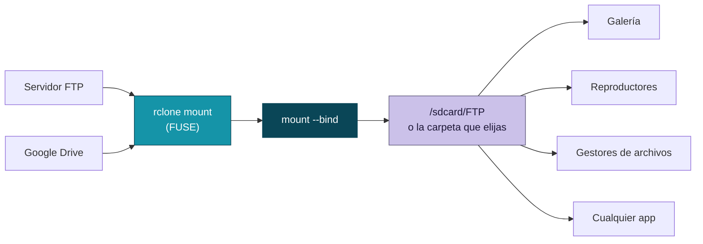
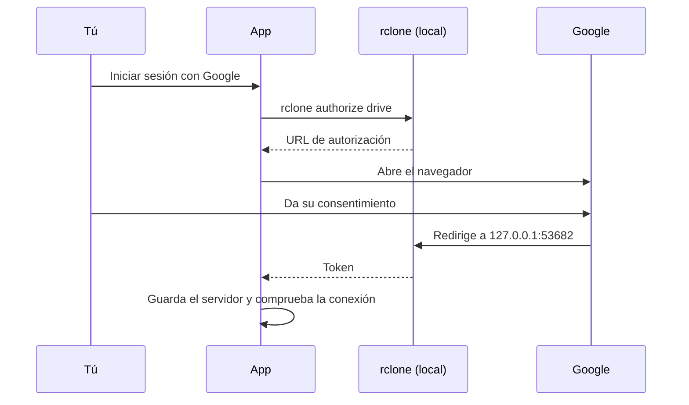

  

  
  
  
  

  
  
  
  
  
  
  

<h3 align="center">Monta servidores FTP y Google Drive como una carpeta más de tu almacenamiento interno. Cualquier app puede usarlos, sin configurar nada en cada una.</h3>

---

## Cómo funciona

Iniciar sesión con Google se hace en el propio teléfono, sin PC:

## Características

### Servidores en una pila de tarjetas

- Cada servidor es una tarjeta; la seleccionada se abre y las demás asoman su franja.
- Tocar una tarjeta elige cuál se monta. Agregar, editar y eliminar desde la misma pantalla.
- Compatible con **FTP** y **Google Drive**.
- Las contraseñas se guardan ofuscadas con `rclone obscure`.
- Al editar, dejar la contraseña vacía conserva la anterior.

### Encuentra tu servidor FTP solo

- Botón **Buscar servidores FTP en mi red**: recorre la subred local y muestra los que responden.
- Sondea el puerto 21 y los que usan las apps de servidor FTP para Android y Termux (2121, 2221 y 2222).
- Usa la red Wi-Fi o Ethernet real aunque haya datos móviles o VPN activos.
- No necesita root: elegir uno rellena Host y Puerto.

### Google Drive sin PC

- Inicio de sesión desde el teléfono con el flujo de autorización de rclone.
- Modo **solo lectura**.
- Interruptor para **permitir archivos marcados como malware** (`acknowledge_abuse`), que Drive bloquea con el error 403 `cannotDownloadAbusiveFile`.
- Montar solo una **carpeta raíz** o una **unidad compartida**.
- **Client ID y Secret propios**, o pegar un token generado en otro equipo.
- Al guardar, comprueba la sesión, la red, el DNS y los certificados listando la raíz de Drive.

### Montaje que se mantiene

- Se monta con `rclone mount` y se expone con `mount --bind` en la **carpeta de destino que elijas** (por defecto `/sdcard/FTP`), con selector de carpetas integrado.
- **Montar al iniciar**: espera a que el almacenamiento esté desbloqueado y reintenta hasta que haya red.
- Un **vigilante** restaura el bind si Android o alguna app lo quita.
- Cambiar de servidor con uno ya montado se hace con un solo botón.
- Caché de disco acotada para Drive.
- **Rendimiento** Equilibrado o Máximo: el modo Máximo usa caché completa también en FTP, lectura anticipada, descargas en paralelo y listados cacheados más tiempo. El **tamaño de caché** es configurable (1 a 50 GB) y se dejan 2 GB libres.

### Instalación y actualizaciones sin fricción

- El zip del módulo **trae la app dentro**: se instala sola al flashear.
- Reflashear **actualiza la app sin perder tus datos**, y la configuración del módulo se conserva.
- Si la instalación silenciosa falla, se reintenta al reiniciar y, como último recurso, abre el instalador del sistema.
- El módulo se actualiza desde el Manager de KernelSU.

### Diseño

- Material 3 con **color dinámico** (Material You) en Android 12 o superior.
- Modo **claro y oscuro** según el sistema, a pantalla completa.
- Esquinas amplias, animaciones con resorte y efecto de desenfoque.
- Icono adaptable con versión monocromática para el tema de íconos.
- Pantallas de **Inicio**, **Servidores**, **Logs** y **Acerca de**, con la versión de la app y de rclone.

### Publicación automática

- Cada compilación exitosa publica un release con el módulo y el APK.
- Los tags `v*` publican una versión con nombre.

## Compatibilidad

| | |
|---|---|
| Root | KernelSU |
| Android | 8.0 o superior |
| Arquitectura | arm64 |
| Remotos | FTP, Google Drive |
| Motor | [rclone](https://rclone.org) |

---

  Usa <a href="https://rclone.org">rclone</a> (MIT), <a href="https://github.com/topjohnwu/libsu">libsu</a> (Apache 2.0) y <a href="https://github.com/chrisbanes/haze">Haze</a> (Apache 2.0).

